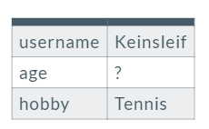
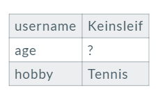
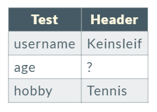

# keinsleif-marp-theme

The marp theme files I'm using commonly.

## Features

### Hide empty table header

```markdown
|||
|---|---|
|username|Keinsleif|
|age|?|
|hobby|Tennis|
```

- gaia  


- This theme  


### Change the color of table header

- gaia  


- This theme  


### Add ".h1" div style class

You can set the style same as h1 tag.

```markdown
<div class="h1">Test</div>
```


